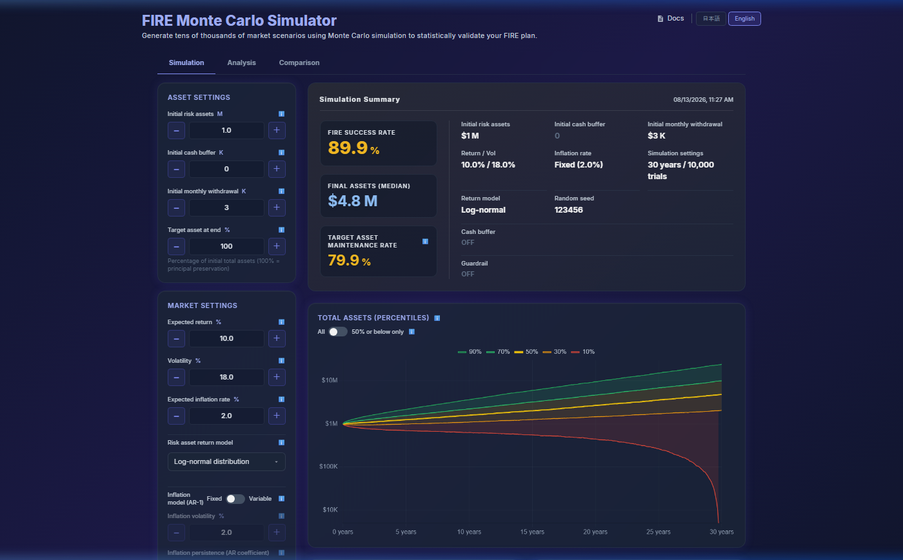

[English](./README.md) | [日本語](./README-ja.md)

[](https://deepwiki.com/moriyama-eng/fire-simulator)

# FIRE Monte Carlo Simulator

市場リターン、インフレ、支出、ポートフォリオの不確実性を考慮し、FIRE後の資産持続性をモンテカルロ法で検証するブラウザベースのシミュレーターです。

---

## 概要

FIRE Monte Carlo Simulator は、ユーザーが定義した財務上の前提条件のもとで、FIRE後の資産持続性をモンテカルロ・シミュレーションで探索するブラウザベースのツールです。

ユーザーは初期資産、月次支出、期待リターン、ボラティリティ、インフレ率、および関連する戦略設定を入力します。シミュレーターは数千本のシミュレーションパスにわたり、確率的な退職資産の推移を算出します。

ブラウザUIはインタラクティブな結果探索を可能にし、ヘッドレスCLIは再現可能な単一実行とJSON出力を提供します。詳細な数理モデルおよびルールの仕様は、[ドキュメント](#ドキュメント)セクションにリンクされた既存ドキュメントに委譲しています。

### 心理的負荷

本シミュレータは、リターンの最大化ではなく、取崩し期の心理的負荷——リタイア後に運用資産が減っていくことへの不安——を中核に据えて設計しています。現金バッファ、支出ガードレール、テールリスク（最大下落・停滞期間）の可視化といった機能は、いずれもこの心理的リスクを具体的に把握し、対処可能にするために存在します。

---

## スクリーンショット



---

## シミュレーションモデル

本シミュレータは以下の7つのコンセプトで構成される**ひとつのシミュレーションモデル**を使用します。

- **対数正規分布リターンモデル** — 対数正規分布を用いた標準的な資産リターンの変動をモデル化します。詳細は [`docs/explanation/mathematical-model.md`](./docs/explanation/mathematical-model.md) を参照。
- **Itoドリフト調整** — 伊藤の補題に基づき、算術期待リターンとボラティリティ・ドラッグにより低下する幾何平均リターンを整合させます。詳細は [`docs/explanation/mathematical-model.md`](./docs/explanation/mathematical-model.md) を参照。
- **対数t分布 / Student-tリターンモデル** — 対数正規分布では過小評価されるファットテールの市場リスクを捉えるため、より裾の重い分布を提供します。詳細は [`docs/explanation/mathematical-model.md`](./docs/explanation/mathematical-model.md) を参照。
- **AR-1インフレモデル** — 歴史的なインフレデータに見られる平均回帰を捉えるため、一次自己回帰（AR-1）プロセスでインフレ動態をモデル化します。詳細は [`docs/explanation/mathematical-model.md`](./docs/explanation/mathematical-model.md) を参照。
- **現金バッファ動態** — 現金バッファを用いた資産取り崩しルールを規定します。総資産がドローダウントリガー水準を下回った場合、リスク資産を直接取り崩すのではなく、現金バッファから支出を賄います。詳細は [`docs/explanation/decision-timing.md`](./docs/explanation/decision-timing.md) を参照。
- **支出ガードレール機構** — ドローダウンに応じて月次支出を調整します。総資産がガードレールトリガー水準を下回ると支出を削減し、回復条件を満たすと元に戻します。詳細は [`docs/explanation/decision-timing.md`](./docs/explanation/decision-timing.md) を参照。
- **ドローダウン / 停滞期間の計測** — シミュレーション全パスにわたり、過去最高値からの最大ドローダウンおよび停滞・回復期間を計測・可視化します。

---

## 使い方

**ひとつのシミュレーションモデル、複数の利用方法。**

### ブラウザUI

[GitHub Pages](https://moriyama-eng.github.io/fire-simulator/) からアクセス可能です。インストール不要。

- **Simulation** — コアのモンテカルロ・シミュレーションをインタラクティブに実行し、確率的な退職資産の推移を探索します。
- **Analysis** — ブラウザUI内でシミュレーション結果を詳細に分析します。
- **Comparison** — ブラウザUI内で複数のシナリオを並べて比較します。

Analysis と Comparison はブラウザUI内の機能であり、独立したシミュレーションエンジンではありません。

### ヘッドレスCLI

CLIはブラウザを開かずに同一シミュレーションモデルへアクセスできるヘッドレスインターフェースです。2つのサブコマンドがあります。

- **`run`** — 単一実行のシミュレーション実行器。JSONパラメータファイルを受け取り、シミュレーション結果をJSON形式で出力します（パーセンタイル時系列を含む）。マルチラン実行、パラメータスイープ、グラフ生成、フォーマット変換は呼び出し側の責務です。
- **`list-factors`** — Analysis UIで使用されるfactor定義を出力します。ブラウザを起動せずにfactorスキーマを確認・スクリプト化するのに便利です。

完全なCLIドキュメントと実行例は、下記の [CLI](#cli) セクションを参照してください。

<a name="currency-semantics"></a>
### 通貨セマンティクス

| 実行モード | 通貨換算 | 金額の入出力単位 | 内部計算単位 |
|---|---|---|---|
| **ブラウザUI（英語モード）** | 表示のみ $1 = 100円 の固定レート換算 | ドル / 万円 / 億円（UI入力単位） | 円 |
| **CLI / ヘッドレスモード** | なし（`currency` はメタデータラベルのみ） | 基本通貨単位（円またはドルそのまま） | 基本通貨単位 |

---

## 主な機能

1. **モンテカルロ退職資産持続性シミュレーション** — 数千本のリターン・支出パスをシミュレーションし、長期資産推移の分布を確率的に評価することで、退職資産の持続性を検証します。
2. **対数正規分布と対数t分布リターンモデル** — 標準的なリターン変動に対応する対数正規分布モデルと、ファットテール市場リスクをより適切に捉える対数t（Student-t）モデルの2つのリターン分布モデルに対応します。
3. **現金バッファ管理** — 現金バッファ戦略による資産取り崩し制御を提供します。総資産が閾値を下回った場合、リスク資産を直接取り崩すのではなくバッファから支出を賄います。
4. **支出ガードレール** — ドローダウンがガードレールトリガー閾値を超えると支出を自動削減し、回復条件を満たすと元に戻します。
5. **Itoドリフト調整** — 伊藤の補題を用いて算術期待リターンとボラティリティ・ドラッグにより低下する幾何平均リターンを整合させ、シミュレーション内部で数学的に一貫したドリフトを保証します。
6. **ドローダウンと停滞期間の分析** — 過去最高値からの最大ドローダウンおよび停滞・回復期間を計測し、累積確率分布グラフ（CDF/CCDF）で可視化します。
7. **テールリスクとAR-1インフレモデリング** — 対数t分布によるファットテールのリターンリスクを捉え、統計的なインフレ特性を参照した一次自己回帰（AR-1）プロセスでインフレ動態をモデル化します。
8. **ヘッドレスCLI実行（単一実行・JSON出力）** — CLIの `run` サブコマンドがヘッドレスモードで単一シミュレーション実行を行い、結果をJSON形式で出力します。ブラウザ不要で自動化・下流分析を実現します。

---

## プライバシー

### ローカル処理

すべてのシミュレーション計算はブラウザ内で実行されます。通常のシミュレーション実行において、シミュレーションの入力値や結果がサーバーに送信されることはありません。

### 外部リソース

アプリケーションは実行時に以下の外部ライブラリを読み込みます。

- [Chart.js](https://www.chartjs.org/) — グラフ描画
- [SortableJS](https://sortablejs.github.io/Sortable/) — ドラッグ＆ドロップUI
- [html2canvas](https://html2canvas.hertzen.com/) — ブラウザ内スクリーンショット出力

これらの外部ライブラリの読み込みは、シミュレーション入力値や結果の送信とは別のものです。

### 明示的な共有

共有URL機能は、パラメータ値・シード・パーセンタイル・言語設定・その他の再現に関するURLパラメータを含むシミュレーション設定をURLのクエリパラメータとしてエンコードします。URLを受け取った側は自分のブラウザで同じシミュレーション条件を再現できます。結果データはサーバーにアップロード・保存されません。

### 自動送信

通常のシミュレーション実行において、シミュレーションの入力値や結果が自動的にサーバーへアップロードされることはありません。

---

## 意図的なスコープ制限

以下は将来対応予定の機能ではなく、意図的なスコープ制限です。

- **税制** — 税制は国や個人によって大きく異なります。組み込むとモデルの焦点がぼやけ、地域の税制文脈に依存しない独立した結果解釈が難しくなります。
- **為替変動モデリング** — 通貨換算モデリングは本シミュレータのスコープ外です。金額はひとつの基本通貨単位で扱われます。
- **社会保障・年金制度** — 年金・社会保障制度は国や個人の状況によって大きく異なるため、自己完結した明確に境界付けられたモデルを保つために意図的に除外しています。

---

## ドキュメント

| ドキュメント | 内容 |
|---|---|
| [概要](./docs/guide/overview.md) | 製品概要（心理的負荷、プライバシー、意図的なスコープ制限、免責事項） |
| [はじめに](./docs/guide/getting-started.md) | ローカル開発環境のセットアップとシミュレーター実行方法 |
| [CLI利用ガイド](./docs/guide/cli-usage.md) | CLIサブコマンド、パラメータ、実行例 |
| [ヘッドレスAPIリファレンス](./docs/reference/headless-api.md) | ヘッドレスAPIスキーマと出力フォーマット |
| [パラメータリファレンス](./docs/reference/parameter-reference.md) | 全パラメータの定義と有効範囲 |
| [数理モデル](./docs/explanation/mathematical-model.md) | リターンモデル、Itoドリフト、AR-1インフレの数理 |
| [意思決定タイミング](./docs/explanation/decision-timing.md) | 月次処理順序、現金バッファ、ガードレール機構の詳細 |
| [テスト](./tests/README.md) | テストドキュメントのエントリーポイント |
| [変更履歴（英語）](./CHANGELOG.md) | 英語版の全更新履歴 |
| [変更履歴（日本語）](./CHANGELOG-ja.md) | 日本語版の全更新履歴 |

---

## バージョン / 更新履歴

**現行リリース: v2.8.7**

全更新履歴は [CHANGELOG-ja.md](./CHANGELOG-ja.md) を参照してください。

---

## CLI

CLIはブラウザUIと同一のシミュレーションモデルを使用するヘッドレス実行インターフェースです。

```bash
# 単一シミュレーション実行 — 結果をJSONファイルに出力
node cli.js run params.json

# 結果をファイルではなくstdoutに出力
node cli.js run params.json --stdout

# カスタム出力ファイルパスを明示指定
node cli.js run params.json --out output/my-result.json

# Analysis UIで使用されるfactor定義を出力
node cli.js list-factors
```

### サブコマンド

**`run`** — 指定したJSONパラメータファイルを使用して単一シミュレーションを実行します。シミュレーション結果（パーセンタイル時系列を含む）をJSON形式で出力します。マルチラン実行、パラメータスイープ、グラフ生成、シナリオ比較、CSV変換は呼び出し側の責務です。

**`list-factors`** — Analysis UIで使用されるfactor定義を出力します。シミュレーションは実行されません。スクリプト化や内容確認のための情報出力コマンドです。

完全なドキュメント、パラメータスキーマ、高度なオプションについては以下を参照してください。
- [CLI利用ガイド](./docs/guide/cli-usage.md)
- [ヘッドレスAPIリファレンス](./docs/reference/headless-api.md)

---

## 免責事項

本ツールは個人の学習・検証目的で作成されたものであり、将来の運用成果を保証するものではありません。
シミュレーション結果に基づく投資判断や資産運用によって生じた、いかなる損害についても作者は責任を負いかねます。最終的な投資判断はご自身の責任で行ってください。運用資産の種類や期間、個々の財務状況に応じた最適な戦略を保証するものではありません。

---

## ライセンス

This project is licensed under the MIT License - see the LICENSE file for details.
